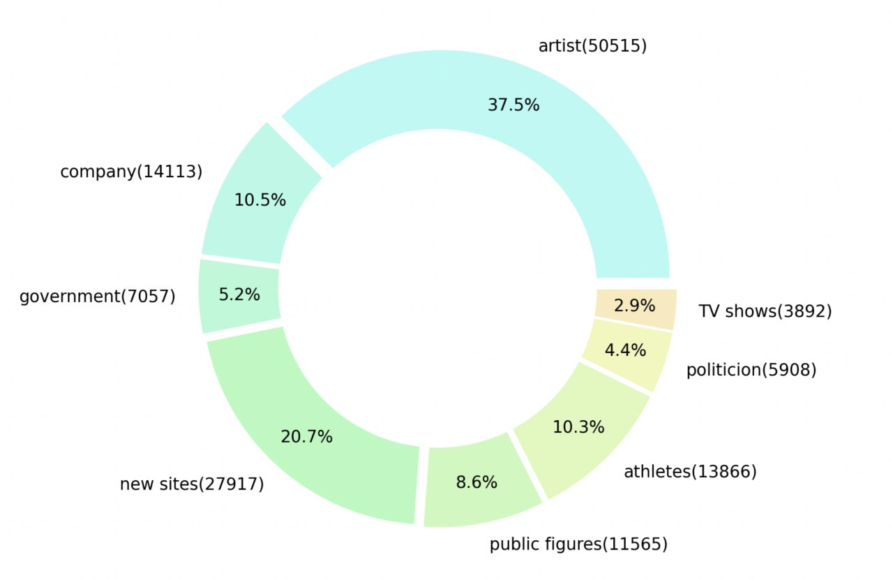
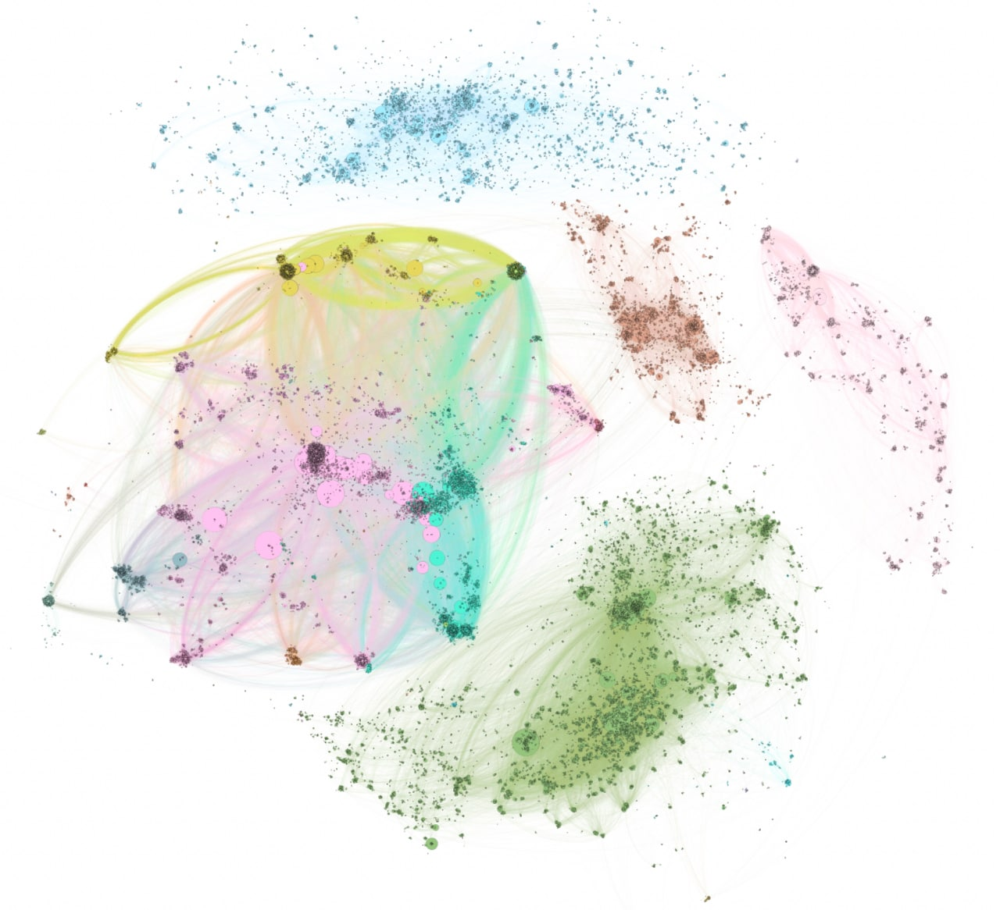

# SocialNetworkGraphAnalysis

The dataset used in this project is the **mutual likes between verified facebook accounts** which consists of different segments. In below we mentioned some types of analysis applied on this data using tools like **Gephi** and libraries such as. **NetworkX** and **graph-tool**.
The image below shows each segment portion in the dataset.

## Topological Properties
Some characteristics such as number of nodes and edges, the minimum, maximum, and mean of degrees in the graph, number of clusters, correlation coefficient in clusters and so on are investigated in this part.

## Centerality Metrics
**K-Shell**, **HIT** and **Page-Rank** are the centrality-metrics used here. 

## Communities in Network
Using **K-core**, **Louvain**, **Infomap**, and **Layered-Label-Propagation the main clusters of the network are found and mentioned in the report.

A visualization of this graph, by using **Louvian** as the community-detection algorithm and **Page-Rank** as the centrality metric, is plotted in following image.

